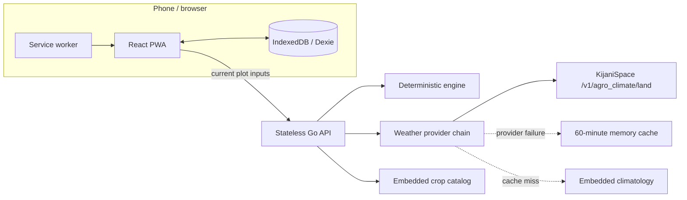

# AXIS Bird's-Eye Guide

Use this page to reorient in under two minutes.

Status legend: ✅ implemented and verified; 🟡 implemented but manually unverified; ↪ changed from the original plan; ⛔ intentionally deferred; ⬜ outstanding.

## Current state

- ✅ The deterministic engine, crop catalog, API, provider/fallback chain, sanitized live Kijani fixture, automated checks, CI, and container path are implemented and verified at their stated levels.
- ✅ The live adapter uses `/v1/agro_climate/land`, selects up to 24 hourly samples beginning at the recommendation time, and records the provider model timestamp in UTC.
- ✅ The responsive PWA, IndexedDB persistence, plots, recommendations, hourly/manual refresh, history, settings, sensor context, irrigation logging, decision snapshots, and agricultural weather timeline are implemented and covered at their stated automated-test levels.
- ✅ An isolated Fly development deployment has recorded HTTPS, live-weather, recommendation-feedback, timeline, SPA-routing, and responsive browser smoke evidence. This is not evidence for production or a physical device.
- ⛔ AI explanations are disabled by default. Soil-humidity adjustment and automatic hardware ingestion are not active product capabilities.
- ⬜ Production credential/deployment verification, physical offline reopen cycles, second-device testing, rehearsal, recording, and submission remain external/manual work.

## Farmer loop

1. Create a plot with crop, planting date or age, area, location, irrigation method, and optional flow rate.
2. Retrieve current Kijani weather or an honestly labeled fallback.
3. Derive the crop stage and calculate deterministic litres and optional minutes.
4. Review source, confidence, freshness, rain adjustment, and calculation steps.
5. Save the complete recommendation locally, continue viewing it offline, and record actual irrigation.
6. Refresh existing advice hourly while the app is active and online, or manually on demand.
7. Inspect historical reanalysis, provider-supplied forecast days, local recommendation/event snapshots, and deterministic future plans in the Weather timeline.

## Architecture

## Implemented boundaries

- No farmer login, backend farmer database, cloud history, or sync/conflict system.
- No LLM control of litres, minutes, confidence, or irrigation decisions.
- No soil-sensor adjustment without local calibration and agronomic validation.
- No automatic flow-meter or sensor ingestion.
- Climatological mean rainfall is never treated as forecast rain.

GitHub Actions runs `mise run check` for pull requests to any target branch and pushes to `main`. Current temporary ownership and manual acceptance tasks are maintained in [`docs/TEAM-HANDOFF.md`](docs/TEAM-HANDOFF.md).
