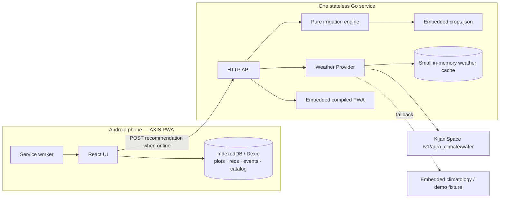

# AXIS Bird's-Eye Guide

Use this page to reorient in under two minutes.

## Current progress — 20 August 2026

Status key: ✅ complete and automatically verified; 🟡 implemented but awaiting live/browser/device verification; ⬜ pending; ⛔ intentionally gated.

- ✅ Deterministic engine, crop catalog, API handlers, fixture/climatology provider chain, cache behavior, golden fixture, and automated backend tests are complete.
- 🟡 Today, Plots, History, More, IndexedDB storage, PWA generation, multi-plot switching, chart, settings, and manual flow-meter readings are implemented and build successfully; physical-phone behavior is not yet verified.
- 🟡 The Kijani adapter is implemented against documented aliases, but a real authenticated payload has not been captured or regression-tested.
- ⛔ AI is disabled by default. Soil-humidity readings are preview context only and never change litres; automatic hardware adapters are not implemented.
- ⬜ Container execution, Fly deployment, two offline force-close/reopen cycles, second-device testing, rehearsal, recording, and submission remain release blockers.

## The demo loop

1. Farmer creates a plot on a phone.
2. Enters crop, crop age, area, irrigation method, and location.
3. AXIS derives the crop's current **uniform growth stage** from age.
4. Go backend fetches weather from KijaniSpace.
5. Deterministic engine computes crop water need and rainfall reduction.
6. Phone displays litres, minutes when flow rate is known, crop stage, weather context and rain-adjusted water avoided.
7. Farmer can open “Why?” and see the calculation.
8. Recommendation is saved in IndexedDB.
9. Airplane mode is enabled; AXIS still opens and shows the saved recommendation.
10. Farmer taps “I irrigated”; manual, recommendation-followed or manually entered cumulative flow-meter readings update seven-day history locally even offline.

## Architecture in one diagram

## What is intentionally missing

- No login/authentication.
- No backend database.
- No cloud storage of plots or irrigation history.
- No server sync/conflict-resolution system.
- No microservices.
- No CI pipeline.
- No sensor requirement.
- No LLM deciding water volume.

Those are deliberate scope cuts for a 24-hour build.

## Three hard freezes

| Productive hour | Freeze | Meaning |
|---|---|---|
| **H1** | Contract freeze | Domain types, API request/response, fixture shape, repo ownership stop changing casually. |
| **H10** | Architecture freeze | No new libraries/services or large model changes. Fix and integrate what exists. |
| **H19** | Feature freeze | No new user-facing features. Only polish, bugs, tests, demo hardening. |
| **H22** | Code freeze | Demo-blocking fixes only; every change requires a full demo rerun. |

## P0 / P1 / stretch

### P0 — must build

- Plot setup: location, crop, **crop age**, area, irrigation method.
- Age → planting-date anchor → automatic stage derivation.
- Real KijaniSpace weather path.
- Deterministic litres recommendation.
- Optional flow rate → minutes.
- Crop growth timeline and compact weather context.
- Clear explanation of ETo, Kc, rainfall, efficiency, area, litres.
- Last recommendation stored locally.
- “I irrigated” local event, with optional flow-meter readings.
- 7-day recommended-versus-applied history.
- Rain-adjustment analytics with an explicit no-rain baseline.
- PWA reopens with network disabled.
- Deployed HTTPS URL.
- Deterministic demo weather mode.

### P1 — should build

- Multi-plot switching.
- 7-day chart and deterministic “Why different?” comparison.
- Contextual rain, freshness, flow-rate and crop-duration alerts.
- Unit/language/default-method settings and Kiswahili catalog labels.
- Install prompt / polished PWA shell.

### Only if ahead

- Calibrated soil-humidity adjuster after agronomic validation; never fake sensor data.
- Hardware adapters for soil sensors and flow meters.
- AI-generated Kiswahili/plain-language explanation and seven-day history insights.

AI is isolated behind `POST /api/v1/insights`, is disabled by default, never returns recommendation fields, and starts only after the deployed P0/offline/test gate passes.

## Team ownership

| Member | Owns | P0 output |
|---|---|---|
| **M1** | Farmer journey UI | Setup → Today → Why screens |
| **M2** | Go HTTP service | Health, catalog, recommendation endpoint, static PWA serving |
| **M3** | Irrigation engine + agronomy | Correct litres, stages, tests, crop data |
| **M4** | Offline/PWA + IndexedDB | Offline shell, local plots/recs/events/history |
| **M5** | Weather + integration + deploy | Kijani adapter, fallback, fixtures, Podman/Fly, deployable main |

## If things are going wrong

Cut in this order: AI → calibrated sensor adjustment → multi-plot polish → history chart → comparison feature → extra crops beyond tomato/maize/kale. Keep the simple history list, flow-rate minutes and rain-adjustment metric because they complete the Action + History story.

**Never cut:** litres calculation, explanation, offline reopening, real weather path, deterministic demo fallback, deployment.
